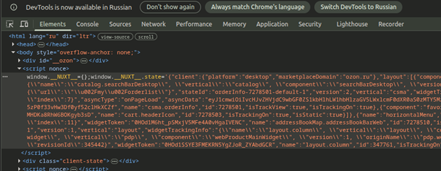

# Card Parser API

Отдельный самостоятельный сервис: вводишь URL карточки товара Ozon —
получаешь сырые данные из встроенного объекта `__NUXT__` в виде JSON.
Дополнительно на диск сохраняются полный HTML страницы и JSON с данными.

Данные карточки здесь:


## Что внутри

```
marketplace_parsing/
├── card_parser.py        # движок: URL -> браузер(stealth) -> __NUXT__ -> данные
├── app.py                # FastAPI-сервис со Swagger поверх движка
├── requirements.txt      # selenium, selenium-stealth, webdriver-manager, fastapi, uvicorn
├── Dockerfile            # python + google-chrome + xvfb
├── docker-compose.yml    # один сервис card-api, порт 8000
├── output/               # сюда падают html и json (примонтировано наружу)
└── README.md
```

## Запуск в Docker

```bash
cd marketplace_parsing
docker compose up --build
```

Когда увидишь в логах, что uvicorn слушает на 0.0.0.0:8000 — открой в браузере:

```
http://localhost:8010/docs
```

Это Swagger UI. Дальше:
1. Раскрой `POST /parse/ozon` → "Try it out".
2. В теле запроса впиши URL карточки:
   ```json
   { "url": "https://www.ozon.ru/product/bryuki-dlya-malyshey-leratutti-3169084399/" }
   ```
3. "Execute". В ответе придёт JSON с данными товара (поле `data`) и именами
   сохранённых файлов (`json_file`, `html_file`).

Остановить: `Ctrl+C`, затем `docker compose down`.


## Где взять файлы

Файлы сохраняются в папку `output/` — она примонтирована, поэтому видна прямо
на хосте после каждого запроса:

- `card_<tag>.html` — полный HTML страницы;
- `card_<tag>.json` — данные товара в JSON;
- `debug_<время>.html` / `debug_<время>.png` — что реально пришло 

Их же можно скачать через API, не лазая в контейнер:
- `GET /files` — список файлов;
- `GET /files/{name}` — скачать конкретный, например `card_3169084399.json`.

Если предпочитаешь достать прямо из контейнера:
```bash
docker compose cp card-api:/app/output ./output_from_container
```

Очистить папку с файлами:
```commandline
sudo rm -rf output/*
```

## Эндпоинты

| Метод | Путь                | Назначение                                   |
|-------|---------------------|----------------------------------------------|
| GET   | `/`                 | проверка, что сервис жив                      |
| POST  | `/parse/ozon`       | распарсить карточку Ozon по URL               |
| POST  | `/parse/ozon/by-id` | распарсить карточку Ozon по артикулу (SKU)     |
| GET   | `/files`            | список сохранённых файлов                      |
| GET   | `/files/{name}`     | скачать файл (html / json / png)               |
| GET   | `/docs`             | Swagger UI                                      |

Файлы в `output/` именуются `ozon_<sku>_<ГГГГММДД_ЧЧММСС>`

## Локальный запуск без Docker - для разработки

Понадобится установленный в системе Chrome/Chromium.

```bash
cd ozon_card_parser
python -m venv .venv && source .venv/bin/activate
pip install -r requirements.txt
uvicorn app:app --host 0.0.0.0 --port 8000
# затем http://localhost:8010/docs
```

Движок можно гонять и как обычный скрипт, без веб-сервиса:
```bash
python card_parser.py "https://www.ozon.ru/product/.../"
# или просто `python card_parser.py` — спросит URL в консоли
```


## Переменные окружения

| Переменная         | По умолчанию   | Зачем                                    |
|--------------------|----------------|------------------------------------------|
| `CARD_HEADLESS`    | `false` (Docker)| `true` — без окна (антибот ловит чаще)   |
| `CARD_OUTPUT_DIR`  | `output`       | куда складывать html/json                 |
| `CARD_URL`         | —              | URL по умолчанию для CLI-режима           |
